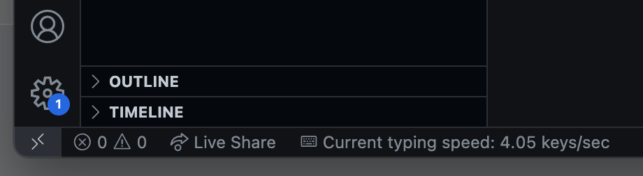
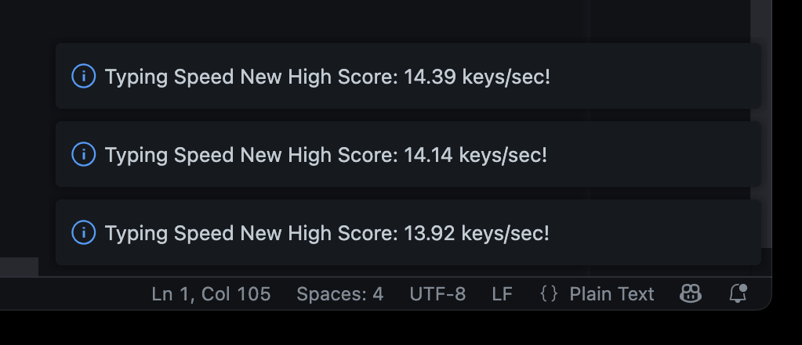
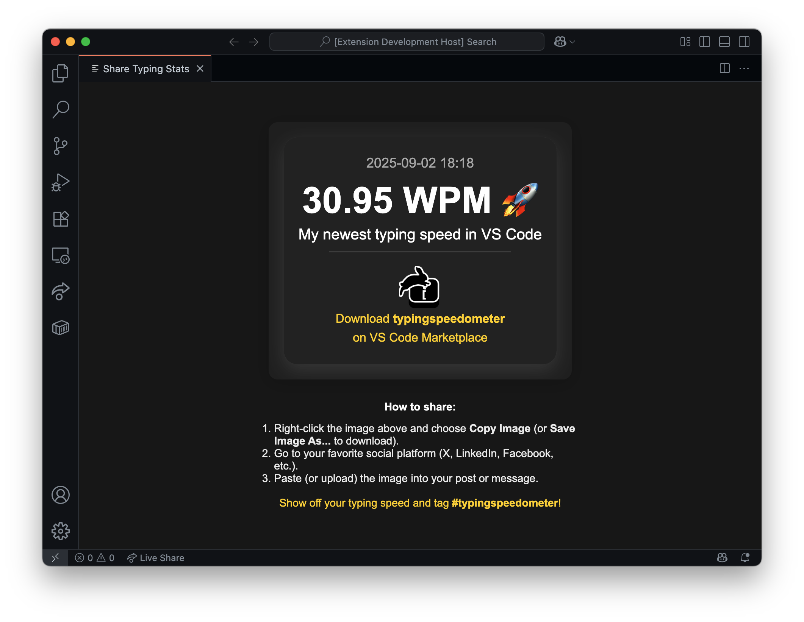

# Typing Speedometer

 

Developers are weird, we flex over random non-technical skills such as typing speed. Use this extension to track your typing speed and keystrokes in Visual Studio Code.

## Features

- Counts keystrokes in the editor
- Words Per Minute (WPM) calculation - Tracks words completed by monitoring spaces, tabs, and enters
- Shows both keystroke speed (keys/sec) and WPM in real-time
- Persists keystroke count and word count between sessions
- Shows high scores for both keystroke speed and WPM
- Share high scores with friends in social media
- Configurable session timeout

## Usage

1. Install the extension.
2. Start typing in any editor window. The extension will automatically count your keystrokes per second and words per minute (WPM).

3. Words are counted each time you type a space, tab, or press enter - indicating word completion.
4. High scores for both keystroke speed and WPM will be automatically saved! Break your own records!

5. Check your high scores with <key>Ctrl</key> <key>Alt</key> <key>S</key>, or by using the Command Palette.

6. Share your typing statistics as an image on social media!

## Settings

- `typingspeedometer.sessionTimeout`: Timeout duration for typing sessions in milliseconds (default: 3000)

## Development

- Source code in `src/`
- Main logic in `src/commands/`

## License

MIT
